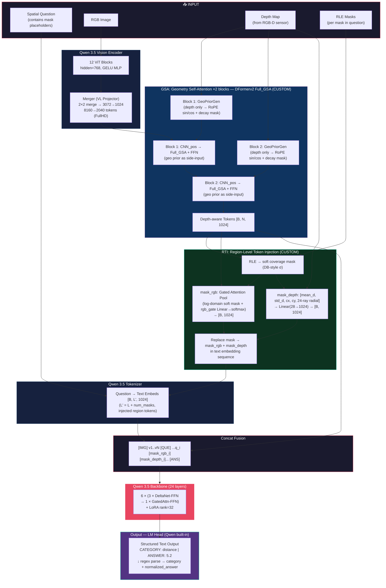

# SpatialVLM Architecture — AI City Challenge 2025 Track 3

## Dataset 

| Split | QA Pairs | RGB-D pairs |
|-------|----------|-------------|
| Train | **499k** | ~78k |
| Test  | 19k | — |
| Val   | 1.9k | — |

**4 Task Categories:**
| Category | `normalized_answer` | Description |
|----------|---------------------|-------------|
| `left_right` | `"left"` or `"right"` | Spatial relation between 2 regions |
| `mcq` | `"0"`, `"1"`, ...  | Region index (which object to pick) |
| `distance` | `9.81` (float, meters) | Distance between 2 regions |
| `count` | `2` (int) | Count of objects in buffer zone |

> **Depth**: ~78k RGB-D pairs — real depth sensor data available \
> **Regions**: encoded as `<mask>` in question text, with per-region **RLE** in JSON

---

> **Focus**: Simplicity & Efficiency & End-to-End — **Single structured LM output, zero mismatch** \
> **Backbone**: Qwen 3.5 0.8B — Native VLM (built-in Vision Encoder)

---

## Qwen 3.5 0.8B Architecture

| Spec | Value |
|------|-------|
| Type | Causal LM **with Vision Encoder** |
| LLM Hidden Dim | 1024 |
| Layers | 24 |
| Layer Layout | 6 × (3 × DeltaNet-FFN → 1 × GatedAttn-FFN) |
| DeltaNet | `linear_attn`: QKV + gate z + delta params (a,b) + conv1d + A_log |
| GatedAttn | `self_attn`: 8Q+2KV heads, dim=256, RoPE, QK-norm |
| FFN (all layers) | **SwiGLU**: gate_proj + up_proj + down_proj, dim=3584 |
| Vocab / Embedding | 248,320 (tied with LM Head) |
| Context Length | 262,144 |

#### Parameter Breakdown (verified)

| Component | Params | % | Detail |
|-----------|--------|---|--------|
| Vision Encoder | 100.59M | 11.79% | 12 ViT blocks (768-dim) + **merger** (VL projector) |
| Token Embeddings (tied w/ LM Head) | 254.28M | 29.81% | 248,320 × 1024 |
| Text Decoder (24 layers + Norm) | 498.11M | 58.40% | 18 DeltaNet + 6 GatedAttn layers |
| **Total** | **852.99M** | 100% | |

#### Vision Encoder Flow (verified)

```
Image [B, 3, H, W]  — Configurable: 1080p / 720p / 540p (16:9)
  → patch_embed (Conv3D) → [B, N, 768]        (N patches, 16px each)
  → pos_embed (learned)
  → 12 ViT blocks (Attn + GELU MLP, 768-dim)
  → merger (VL Projector):
      LayerNorm(768)
      → spatial merge 2×2 patches  → [B, N/4, 4×768=3072]
      → MLP(3072→3072, GELU, 3072→1024)
  → visual tokens [B, N/4, 1024]
```

**Dynamic resolution examples (from image_grid_thw):**

| Input | ViT patches | Post-merger tokens | Grid layout |
|-------|------------|-------------------|-------------|
| 448×448 (square test) | 28×28 = 784 | 196 | 14×14 (square) |
| 960×540 (540p) | 60×34 = 2040 | 510 | 30×17 |
| 1280×720 (720p) | 80×44 = 3520 | 880 | 40×22 |
| 1920×1080 (1080p, original) | 120×68 = 8160 | 2040 | 60×34 |

> **Key**: Grid is **rectangular** for 16:9 images. `isqrt(N)` crashes — use `image_grid_thw` from processor. \
> `model.visual()` returns **pre-merger** (768-dim). Merger is called manually. \
> **Resolution** set via `--resolution` flag in training script (default: 1080p).

---

## Pipeline Overview

### Main Pipeline



## Custom Modules (Implementation Files)

Qwen 3.5 provides the full VLM pipeline out-of-the-box. We add only **2 custom modules**:

| Custom Module | File | Position | Function | Params |
|--------------|------|----------|----------|--------|
| **GSA** (2 blocks) | `gsa.py` | After Merger, before Concat | Inject depth geometry into visual tokens | **~16.9M** |
| **RTI** | `region_token.py` | After GSA, before Backbone | Decode RLE → `<mask_rgb><mask_depth>` token injection | **~0.032M** |
| **Full Pipeline** | `pipeline.py` | — | Integrates Qwen 3.5 + all custom modules | — |

---

### GSA Detail — DFormerv2 Full_GSA (CVPR 2025, 2 blocks × 8.46M)

| Sub-module | Params/block | Notes |
|------------|-------------|-------|
| `GeoPriorGen` | ~0.000M (2 params) | RoPE + exponential depth/pos decay, learnable blend weight |
| `cnn_pos_encode` DWConv2d(1024, 3, 1, 1) | 0.010M | Local spatial context before attention |
| `norm1` LayerNorm(1024) | 0.002M | Pre-attention norm |
| `Full_GSA` (Q/K/V/O + lepe DWConv5×5) | 4.225M | Full N×N attention + geometry prior + RoPE |
| `norm2` LayerNorm(1024) | 0.002M | Pre-FFN norm |
| `FeedForwardNetwork` (FC→GELU→DWConv→FC) | 4.218M | FFN with subconv local context |
| **Per block** | **~8.457M** | |
| **× 2 blocks** | **~16.91M** | Verified ✅ |

> **FullHD example**: 1920×1080 → ViT patches [120×68=8160] → merger 2×2 → h_vis=34, w_vis=60 → N=2040 tokens (non-square ✅) \
> `image_grid_thw` always passed explicitly — never use `isqrt(N)` on non-square grids.

---

### RTI Detail (Region-Level Token Injection)

**Problem**: `<mask>` in the question is an empty token — the model has no information about where that region is in the image.

**Solution**: Each `<mask>` → 2 consecutive tokens `<mask_rgb><mask_depth>`:

```
<image> From this viewpoint, does the pallet <mask> appear on the right-hand side of the pallet <mask>?
→
<image> From this viewpoint, does the pallet <mask_rgb><mask_depth> appear on the right-hand side of the pallet <mask_rgb><mask_depth>?
```

#### RTI Data Flow

```
RLE dict  ("size":[1080,1920], "counts":"...")
    ↓
decode → binary mask [1080, 1920]
    ↓
resize → patch coverage [h_vis, w_vis]  (adaptive_avg_pool → float [0,1])
    ↓ DB-style soft binarization
soft_mask = σ(K × (coverage − θ))  K=50, θ=0.3  [h_vis, w_vis] ∈(0,1)
         ↙                                  ↘
 visual_tokens (post-GSA)              depth_map [B, H, W]
 [B, N, 1024]                               ↓
     ↓                            pixel-level masked vals → [B, M]
 Gated Attention Pool (soft)                 ↓
   score_i = Linear(token_i)      mean_d, std_d, cx_soft, cy_soft → [B, 4]
   log_soft_i = log(soft_mask_i)  24-ray radial depth profile     → [B, 24]
   weights = softmax(score+log_soft)  concat → stats [B, 28]
   mask_rgb = Σ wᵢ · tokenᵢ           ↓
     ↓                        Linear(28→1024) + LayerNorm
 [B, 1024]                         [B, 1024]
 <mask_rgb>                        <mask_depth>
         ↘                         ↙
   inject into text embedding sequence at <mask> positions
```

#### RTI Sub-modules

| Sub-module | Params | Details |
|------------|--------|---------|
| RGB gate (Gated Attention Pool) | `Linear(1024, 1, bias=False)` = 1,024 | Learned importance score; log-domain DB-style soft mask |
| Depth projector | `Linear(28, 1024) + LayerNorm` = 31,744 | [mean_d, std_d, cx_soft, cy_soft, r0..r23] → 1024-dim depth token |
| **Total RTI** | **~0.032M** (32,768 params) | |

#### RTI — mask_rgb: DB-style Soft Masking

Instead of hard binarization (`coverage ≥ 0.5`), we use **differentiable binarization** (as in DBNet++):

```
soft_mask = σ(K × (coverage − θ)),   K=50, θ=0.3
```

Gated Attention Pool with soft mask:
```
score_i    = Linear(token_i)           [B, N]
log_soft_i = log(σ(K(c_i − θ)))        [N]   — from patch coverage fraction
weights    = softmax(score + log_soft)  [B, N]
mask_rgb   = Σ weights_i × token_i     [B, 1024]
```

#### RTI — mask_depth:

```
Stats: [mean_d, std_d, cx_soft, cy_soft, r0..r23]  — 28 dims, all ✅ gradient
cx_soft = Σᵢ(col_i × soft_i) / Σᵢ(soft_i)  — soft-weighted centroid X
24-ray radial depth profile (F.grid_sample bilinear, differentiable):
  r_k = soft-weighted avg depth along ray θ_k = k×15°, k=0..23
  Cast from (cx,cy), weighting by soft_mask — distinguishes overlapping masks
```

| Stat | Gradient | Meaning |
|------|----------|---------|
| `mean_d` | ✅ Non-zero | Average depth of the region |
| `std_d` | ✅ Non-zero | Depth uniformity within the region |
| `cx_soft` | ✅ Non-zero | Centroid X (soft-weighted from DB soft_mask) |
| `cy_soft` | ✅ Non-zero | Centroid Y (soft-weighted from DB soft_mask) |
| `r0..r23` (24 rays, k×15°) | ✅ Non-zero | Radial depth profile — distinguishes overlapping masks & complex shapes |

### LM Head -- Structured Output Format

Instead of separate custom heads, the **LM Head (Qwen built-in)** is fine-tuned to produce structured text output directly:

```
distance | 5.2
```

| Field | Meaning | Example |
|-------|---------|---------|
| Category | Task type | `distance` / `count` / `left_right` / `mcq` |
| `\|` | Separator | Always `\|` |
| Answer | Exact `normalized_answer` | `5.2`, `"left"`, `3`, `"2"` |

#### Target string during training (preprocessed from JSON):

```python
target = f"{category} | {formatted_answer}"
# Examples:
# "distance | 5.2"
# "left_right | \"left\""
# "count | 3"
# "mcq | \"2\""
```

> **Direct answer only** -- no free-form explanation. The model is forced to commit
> to a direct answer with no context, reducing hallucination and ensuring
> the model focuses on spatial reasoning accuracy.

#### Format Enforcement -- System Prompt

A **fixed system prompt** is prepended to every input so that Qwen always follows the format:

```python
SYSTEM_PROMPT = (
    "You are a spatial reasoning assistant.\n"
    "Your response MUST be exactly one line in this format:\n"
    "CATEGORY | VALUE\n\n"
    "CATEGORY must be exactly one of these four words:\n"
    "  left_right\n"
    "  mcq\n"
    "  distance\n"
    "  count\n\n"
    "The separator ' | ' (space pipe space) is mandatory.\n\n"
    "VALUE rules:\n"
    '- left_right: "left" or "right" (with double quotes)\n'
    '- mcq: "0", "1", "2", etc. (with double quotes)\n'
    "- distance: a decimal number like 5.2 (no quotes)\n"
    "- count: an integer like 3 (no quotes)\n\n"
    "Examples:\n"
    'left_right | "left"\n'
    'mcq | "1"\n'
    "distance | 5.2\n"
    "count | 3\n\n"
    "Output ONLY the category, pipe, and value. Nothing else."
)
```

Prepend system prompt to every input during **both training and inference** (using Qwen chat template):

```python
messages = [
    {"role": "system", "content": SYSTEM_PROMPT},
    {"role": "user",   "content": question_with_image},
]
# Qwen tokenizer handles <|im_start|>system ... <|im_end|> automatically
input_ids = tokenizer.apply_chat_template(messages, return_tensors="pt")
```

> Same format at train and inference -- model learns the correct distribution \
> System prompt adds no parameters -- it is only a prefix token sequence

#### Training -- Standard Prompt Masking

The entire answer string is trained on with CE loss. Only the prompt tokens (system + user) are masked with `-100`:

```python
# Full answer string:  distance | 5.75
# Labels:              active   active  active
#                      (all answer tokens are trained)
```

The model learns to generate the complete `category | value` string, including the separator. This avoids BPE boundary issues that arise from trying to mask individual format tokens.

#### Inference -- Single-shot Generation

At inference, the model generates the entire answer in one `model.generate()` call, then the output is parsed via regex:

```python
# Model generates freely: "distance | 5.75"
# Regex extracts: category="distance", answer="5.75"
```

| Mechanism | Training | Inference |
|-----------|----------|-----------|
| **System Prompt** | Prepended to every sample | Same prompt used |
| **Answer string** | All tokens active (CE loss) | Generated freely |
| **Parsing** | Not needed (labels are pre-built) | Regex extraction |

> Format learned from system prompt examples + training signal \
> No fill-in-blank, no multi-stage generation, no BPE boundary issues

---

### Training Loss

```
L = L_lm = CrossEntropy(lm_logits, answer_tokens)
```

CrossEntropy computed on **all answer tokens** (category + separator + value). Prompt tokens are masked with `-100` and contribute zero loss.

```
Target:  distance | 5 . 7 5
Labels:  active   active  active
         ^^^^^^^^^^^^^^^^^^
         (full CE on all answer tokens)
```

> No format token masking needed -- the simplified format avoids BPE boundary issues entirely.

---

## Training Strategy (2 Phases)

### Phase 1: GSA + RTI Warmup (3 epochs)

| Component | Status | LR |
|-----------|--------|-----|
| Qwen 3.5 (vision + backbone) | Frozen | -- |
| GSA (2 blocks) | Trainable | 1e-4 |
| RTI | Trainable | 1e-4 |

**Loss**: `L = L_lm` -- CE on content tokens only (category + answer) \
**Goal**: Teach GSA/RTI to produce geometry-aware representations; model learns to predict correct category and answer value.

### Phase 2: Full Fine-tuning (5 epochs)

| Component | Status | LR |
|-----------|--------|-----|
| Qwen 3.5 Vision Encoder | LoRA (rank=32) | 5e-5 |
| Qwen 3.5 Backbone | LoRA (rank=64) | 2e-5 |
| GSA + RTI | Trainable | 5e-5 |

**Loss**: `L = L_lm` -- same as Phase 1; LoRA adapters fine-tune backbone toward spatial reasoning.

