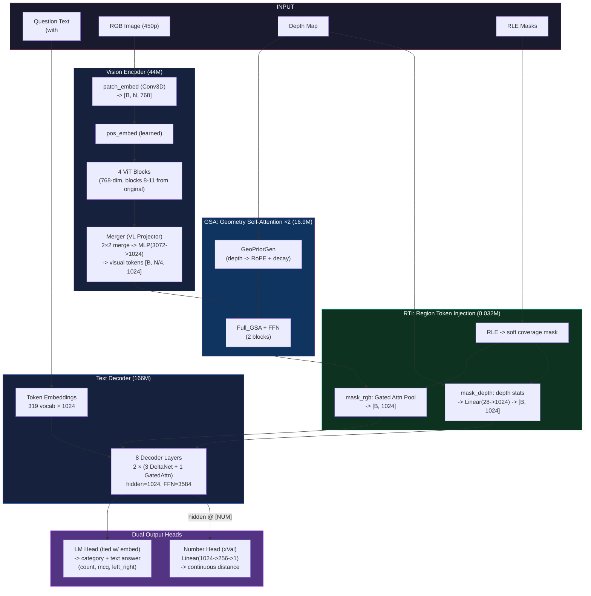

# SpatialVLM Architecture — Qwen 3.5 Micro (211M)

## Origin

Surgically pruned from **Qwen 3.5 0.8B (853M)** — a 75% parameter reduction.
Pretrained weights are transferred (not random init), then fine-tuned on the 499K warehouse dataset.

| Cut | Original | Micro | Savings |
|-----|----------|-------|---------|
| Vision ViT blocks | 12 | **4** | 56.7M |
| Decoder layers | 24 (6 groups) | **8 (2 groups)** | 332M |
| Vocab size | 248,320 | **319** | 253.7M |
| Context length | 262,144 | **2,048** | VRAM only |
| Number Head | — | **+0.26M** (NEW, softplus) | — |
| **Total** | **853M** | **~211M** | **~642M (75%)** |

> **Key**: `hidden_dim = 1024` is **unchanged** — all tensor shapes between modules stay identical.
> GSA and RTI require **zero modification**.

---

## Dataset

| Split | QA Pairs | RGB-D pairs |
|-------|----------|-------------|
| Train | **499K** | ~78K |
| Test  | 19K | — |
| Val   | 1.9K | — |

**4 Task Categories:**
| Category | `normalized_answer` | Description |
|----------|---------------------|-------------|
| `left_right` | `"left"` or `"right"` | Spatial relation between 2 regions |
| `mcq` | `"0"`, `"1"`, ...  | Region index (which object to pick) |
| `distance` | `9.81` (float, meters) | Distance between 2 regions |
| `count` | `2` (int) | Count of objects in buffer zone |

> **Depth**: ~78K RGB-D pairs — real depth sensor data available \
> **Regions**: encoded as `<mask>` in question text, with per-region **RLE** in JSON \
> **Tokens used**: 318 unique (full dataset scan) + 1 `[NUM]` token -> **319 vocab** (no buffer)

---

## Qwen 3.5 Micro Architecture

| Spec | Original 0.8B | **Micro** |
|------|-----------|-----------|
| Type | VLM (Vision + Language) | Same |
| LLM Hidden Dim | 1024 | **1024** (unchanged) |
| Vision Blocks | 12 | **4** |
| Vision Hidden Dim | 768 | **768** (unchanged) |
| Decoder Layers | 24 | **8** |
| Layer Layout | 6 × (3 DeltaNet + 1 GatedAttn) | **2 × (3 DeltaNet + 1 GatedAttn)** |
| FFN (SwiGLU) dim | 3584 | **3584** (unchanged) |
| Vocab / Embedding | 248,320 | **319** |
| Context Length | 262,144 | **2,048** |
| **Number Head** | — | **Linear(1024->256->1)** |

### Parameter Breakdown

| Component | Params | % | Detail |
|-----------|--------|---|--------|
| Vision Encoder | 44.10M | 20.9% | 4 ViT blocks (768-dim) + merger |
| Token Embeddings (tied w/ LM Head) | 0.33M | 0.2% | 319 × 1024 |
| Text Decoder (8 layers + Norm) | 166.04M | 78.6% | 6 DeltaNet + 2 GatedAttn |
| Number Head | 0.26M | 0.1% | xVal-style regression (softplus) |
| **Total (Qwen Micro)** | **~211M** | 100% | |
| GSA (2 blocks, custom) | +16.91M | — | Unchanged from v1 |
| RTI (region tokens, custom) | +0.032M | — | Unchanged from v1 |
| **Grand Total (loaded)** | **~228M** | | |

### VRAM Estimate (FP16 training)

| | Original 0.8B | **Micro 211M** |
|---|---|---|
| Model weights | ~1.7 GB | **~0.45 GB** |
| KV cache (inference) | ~2 GB | **~0.02 GB** |
| Gradients + optimizer | ~5 GB | **~1.4 GB** |
| Batch data headroom (12GB GPU) | ~3 GB | **~10 GB** |
| **Estimated batch size** | 1–2 | **8–16** |

---

## Pruning Strategy — Which Weights to Keep

### Vision: 12 -> 4 ViT Blocks

**Keep the LAST 4 blocks: [8, 9, 10, 11] -> renumber to [0, 1, 2, 3]**

Later ViT blocks encode higher-level semantic features (object identity, spatial layout).
Early blocks (0–7) do low-level edge/texture processing. With fine-tuning, the remaining
4 blocks can compensate. The merger (VL projector) is kept as-is.

```
Original:  block.0  block.1  block.2  ...  block.7  [block.8  block.9  block.10  block.11]
                                                      ^^^^^^^^^^^^^^^^^^^^^^^^^^^^^^^^^^^^^^^^
Micro:                                               [block.0  block.1  block.2   block.3 ]
```

**Kept components:**
- `patch_embed` (Conv3D): unchanged — 1.18M
- `pos_embed`: unchanged — 1.77M
- `blocks.8->0, 9->1, 10->2, 11->3`: 4 × 7.09M = 28.36M
- `merger`: unchanged — 12.59M

### Decoder: 24 -> 8 Layers (2 groups)

**Keep groups [0, 5] -> renumber to [0, 1]**

- Group 0 (layers 0–3): **early** — question parsing, token-level understanding
- Group 5 (layers 20–23): **late** — answer generation, cross-modal fusion

```
Original:  [Group 0]  Group 1  Group 2  Group 3  Group 4  [Group 5]
           layers 0-3                                      layers 20-23
              ↓                                               ↓
Micro:     [Group 0]                                      [Group 1]
           layers 0-3                                     layers 4-7
```

**Per group** = 3 × DeltaNet (~21.55M each) + 1 × GatedAttn (~18.35M) = ~83.0M
**2 groups** = ~166.0M

**Layer type pattern**: `[linear, linear, linear, full, linear, linear, linear, full]`

### Vocabulary: 248,320 -> 319

Full dataset scan (all fields across 499K train + 1.9K val + 19K test + system prompt):
**318 unique Qwen token IDs**. Add 1 `[NUM]` token -> **319 total**. No buffer padding.

We keep **Qwen's original tokenizer** and remap IDs. This preserves pretrained embedding
knowledge — each new token ID maps directly to an existing Qwen embedding row.

Implementation: `model_micro/train_tokenizer.py` -> outputs `micro_vocab.json` + `micro_token_mapping.json`

1. Tokenize all data fields with Qwen tokenizer -> collect 318 unique token IDs
2. Build mapping: `old_id -> new_id (0..317)`, `[NUM] = 318`
3. Slice embedding: `new_embed = old_embed[kept_old_ids]` -> `[318, 1024]`
4. Append random init for `[NUM]`: final embed = `[319, 1024]`

**Token ID Remapping** (runtime, in `model_micro/pipeline.py`):

The original Qwen tokenizer is kept for text encoding/decoding. At runtime, the pipeline
remaps IDs using `micro_token_mapping.json`:

| Direction | Method | Where |
|-----------|--------|-------|
| old -> new | `pipeline.remap_to_new(ids)` | Before `embed_tokens()`, before CE labels |
| new -> old | `pipeline.remap_to_old(ids)` | After `generate()` for tokenizer decode |

The loss function accepts `remap_fn=pipeline.remap_to_new` to remap labels automatically.

### Context: 262,144 -> 2,048

Config-only change. RoPE is computed dynamically — no weight modification.

At 450p input resolution with 2×2 spatial merge:
- Visual tokens: ~130 (adaptive, depends on aspect ratio)
- System prompt: ~80 tokens
- Question + mask tokens: ~100–300
- Answer: ~10 tokens
- **Total: ~320–520 tokens** — fits easily in 2,048

---

## Pipeline Overview



---

## Custom Modules

| Custom Module | File | Position | Function | Params |
|--------------|------|----------|----------|--------|
| **GSA** (2 blocks) | `gsa.py` | After Merger, before Decoder | Inject depth geometry into visual tokens | **~16.9M** |
| **RTI** | `region_token.py` | After GSA, before Decoder | Decode RLE -> `<mask_rgb><mask_depth>` injection | **~0.032M** |
| **Number Head** | `num_head.py` | After Decoder | xVal-style distance regression | **~0.26M** |

### GSA Detail — DFormerv2 Full_GSA (2 blocks × ~8.46M)

Unchanged from v1. Operates on visual tokens [B, N, 1024] with depth prior.

| Sub-module | Params/block |
|------------|-------------|
| GeoPriorGen | ~0.000M |
| cnn_pos_encode | 0.010M |
| Full_GSA (Q/K/V/O + lepe) | 4.225M |
| FeedForwardNetwork | 4.218M |
| **× 2 blocks** | **~16.91M** |

### RTI Detail — Region-Level Token Injection

Each `<mask>` -> `<mask_rgb><mask_depth>` (2 tokens).

| Sub-module | Params |
|------------|--------|
| RGB gate | 1,024 |
| Depth projector | 31,744 |
| **Total** | **~0.032M** |

### RTI Batching Strategy (NEW — enables batch_size > 1)

The v1 RTI processed masks serially with `batch_size=1` only. The Micro RTI supports `batch_size > 1`
via per-sample processing with padded output.

Implementation: `model_micro/rti.py` + `src/dataloader/dataloader_new.py`

| Aspect | v1 | Micro |
|--------|-----|-------|
| `forward()` input | `rle_list: list[dict]` (single sample) | `rle_list: list[list[dict]]` (batched) |
| `inject_into_text_embeds()` output | `[1, L', D]` | `[B, max_L', D]` + output lengths |
| `collate_fn()` | `assert batch_size == 1` | Pads to max length, nests masks as `list[list]` |
| Effective batch | 1 (grad accum only) | **8–16** (true batching) |

### Number Head — xVal-style Regression (NEW)

Implementation: `model_micro/num_head.py`

`LayerNorm(1024) -> Linear(1024, 256) -> GELU -> Linear(256, 1) -> softplus()`

Params: ~262K. Takes hidden state at `[NUM]` position, outputs non-negative scalar.
`softplus(x) = log(1 + exp(x))` — smooth everywhere, always positive (no gradient discontinuity).

**Why this fixes the distance and count problems:**

| | Old (CE on digits) | New (Number Head) |
|---|---|---|
| `4.52` distance | 4 tokens: `"4"` `"."` `"5"` `"2"` | 1 token: `[NUM]` -> scalar 4.52 |
| `3` count | 1 token: `"3"` | 1 token: `[NUM]` -> scalar 3.0 |
| Loss for pred=4.50 | CE(2->0) ≈ same penalty | SmoothL1 = 0.0 (< β) |
| Loss for pred=9.52 | CE(4->9) ≈ same penalty | SmoothL1 = 4.5 (linear) |
| Correct signal? | ✗ (magnitude blind) | ✓ (proportional, bounded grad) |
| Benchmark metric | RMSE (both tasks) | ✓ MSE training = RMSE eval |

---

## LM Head — Structured Output Format

### Text-only tasks (mcq, left_right)

Standard text generation via LM Head: `left_right | "left"`, `mcq | "2"`

### Numeric tasks: distance AND count (NEW)

The answer contains a `[NUM]` token instead of digit tokens. The Number Head reads its
hidden state to output a continuous scalar.

| Task | Target text | Number Head target | LM Head learns | Number Head learns |
|------|-------------|-------------------|----|----|
| left_right | `left_right \| "left"` | — | Full answer | — |
| mcq | `mcq \| "2"` | — | Full answer | — |
| distance | `distance \| [NUM]` | 5.73 | Category + format | Distance value |
| count | `count \| [NUM]` | 3.0 | Category + format | Count value |

---

## Loss Function

Implementation: `model_micro/loss.py`

`L = L_CE + α · L_SmoothL1`

- **L_CE**: Autoregressive CrossEntropy on all tokens (ignores -100 prompt tokens)
- **L_SmoothL1**: SmoothL1 (Huber) on Number Head output vs ground truth (distance + count)
  - Bounded gradients (max 1.0 per sample) — eliminates gradient spikes from large targets
  - β=1.0: quadratic for |error| < 1, linear for |error| ≥ 1
- Front-trims labels to align with RTI-modified logits

---

## Training Strategy — Full Fine-tuning from Scratch

**No phased warmup. No LoRA.** The Micro model is small enough for full fine-tuning
on a 12GB GPU from the very first epoch. All components train simultaneously.

**Why single-phase:**
- Model weights: ~0.42 GB -> ~1.7 GB total with gradients + Adam states
- Leaves ~10 GB for batch data (batch size 8–16 with FP16)
- Groups 1–4 were pruned, so the remaining early (group 0) and late (group 5)
  layers must re-learn to communicate directly — full fine-tuning is preferred
- LoRA's low-rank constraint would bottleneck this adaptation

| Component | Status | LR |
|-----------|--------|-----|
| Vision Encoder (4 ViT blocks) | **Trainable** | 5e-5 |
| Token Embeddings | **Trainable** | 2e-5 |
| Text Decoder (8 layers) | **Trainable** | 2e-5 |
| GSA (2 blocks) | **Trainable** | 5e-5 |
| RTI | **Trainable** | 5e-5 |
| Number Head | **Trainable** | 5e-4 |

**Loss**: `L = L_CE + α·L_SmoothL1` (SmoothL1 active for distance + count samples)

**Optimizer**: AdamW with cosine LR scheduler, warmup steps = 500

> **Batch size**: With ~0.42 GB model weights on 12GB RTX 3060, expect **batch size 8–16**
> with FP16 mixed precision. This is a 4–8× improvement over the original 0.8B model.

---

## Pruning Implementation Script

Implementation: `model_micro/prune.py`

Usage: `python model_micro/prune.py`
Steps:
1. Load original Qwen 3.5 0.8B weights
2. Prune vision encoder: blocks [8,9,10,11] -> renumber [0,1,2,3]
3. Prune decoder: layers [0,1,2,3,20,21,22,23] -> renumber [0..7]
4. Prune vocabulary: use `micro_token_mapping.json` to slice embeddings [319, 1024]
5. Add `[NUM]` token (random init)
6. Save pruned checkpoint + updated config

---

## Visual Token Count at Different Resolutions

| Input | ViT patches | Post-merger tokens | Fits 2048 ctx? |
|-------|------------|-------------------|----------------|
| 448×252 (450p-ish) | 28×16 = 448 | 112 | ✅ ~520 total |
| 640×360 (360p) | 40×22 = 880 | 220 | ✅ ~630 total |
| 800×450 (450p) | 50×28 = 1400 | 350 | ✅ ~760 total |
| 960×540 (540p) | 60×34 = 2040 | 510 | ✅ ~920 total |
| 1280×720 (720p) | 80×44 = 3520 | 880 | ⚠️ ~1290 total |
| 1920×1080 (1080p) | 120×68 = 8160 | 2040 | ✗ Exceeds 2048 |

> At 450p training resolution, total sequence length is ~520–760 tokens.
> Context length of 2048 supports up to ~720p comfortably.
