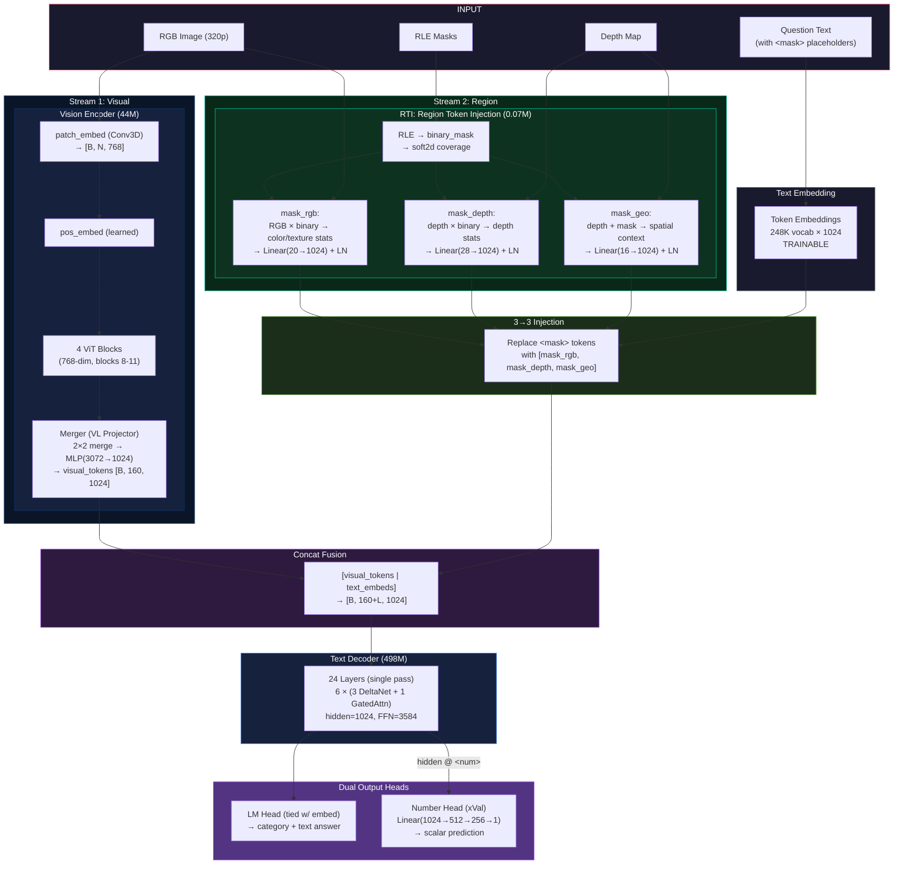

# SpatialVLM Architecture — Qwen 3.5 Micro

## Origin

Surgically pruned from **Qwen 3.5 0.8B (853M)** — vision encoder pruned, decoder kept in full.
Pretrained weights are transferred (not random init), then fine-tuned on the 499K warehouse dataset.

| Cut | Original | Micro  | Savings |
|-----|----------|----------|---------| 
| Vision ViT blocks | 12 | **4** | 56.7M |
| Decoder layers | 24 | **24 (full, single pass)** | 0 |
| Vocab / Embedding | 248,320 | **248,320 (full + `<num>`, TRAINABLE)** | 0 |
| Context length | 262,144 | **512** | VRAM only |
| RTI | mask_rgb + mask_depth + space | **mask_rgb + mask_depth + mask_geo (3 learned tokens)** | — |
| Number Head | — | **+0.66M** (NEW, softplus) | — |
| **Total** | **853M** | **~797M (~797M trainable)** | **~56M (7%)** |

> **Key**: `hidden_dim = 1024` is **unchanged** — all tensor shapes between modules stay identical.

---

## Dataset

| Split | QA Pairs | RGB-D pairs |
|-------|----------|-------------|
| Train | **499K** | ~78K |
| Test  | 19K | — |
| Val   | 1.9K | — |

**4 Task Categories:**
| Category | `normalized_answer` | Description |
|----------|---------------------|-------------|
| `left_right` | `"left"` or `"right"` | Spatial relation between 2 regions |
| `mcq` | `"0"`, `"1"`, ...  | Region index (which object to pick) |
| `distance` | `9.81` (float, meters) | Distance between 2 regions |
| `count` | `2` (int) | Count of objects in buffer zone |

> **Depth**: ~78K RGB-D pairs — real depth sensor data available \
> **Regions**: encoded as `<mask>` in question text, with per-region **RLE** in JSON \
> **Vocab**: Full original vocabulary (248,320 = 248,076 + `<num>` token + `<PAD>` token) \
> **CoT**: GPT reasoning wrapped in `<think>...</think>` as chain-of-thought training signal \
> **Labels**: Question & answer tokenized separately then concatenated (BPE-safe boundary)

---

## Qwen 3.5 Micro  Architecture

| Spec | Original 0.8B | **Micro ** |
|------|-----------|-----------|
| Type | VLM (Vision + Language) | Same |
| LLM Hidden Dim | 1024 | **1024** (unchanged) |
| Vision Blocks | 12 | **4** (pruned) |
| Vision Hidden Dim | 768 | **768** (unchanged) |
| Decoder Layers | 24 | **24 (full, single pass)** |
| Layer Layout | 6 × (3 DeltaNet + 1 GatedAttn) | **6 × (3 DeltaNet + 1 GatedAttn)** (unchanged) |
| FFN (SwiGLU) dim | 3584 | **3584** (unchanged) |
| Vocab / Embedding | 248,320 | **248,320 (full + `<num>`)** |
| Context Length | 262,144 | **512** |
| **RTI** | — | **3 learned tokens per `<mask>`** |
| **Number Head** | — | **Linear(1024→512→256→1)** |

### Parameter Breakdown

| Component | Params | Trainable | Detail |
|-----------|--------|-----------|--------|
| Vision Encoder | 44.10M | ✅ Yes | 4 ViT blocks (768-dim) + merger |
| Token Embeddings (tied w/ LM Head) | 254M | ✅ **Trainable** | 248,321 × 1024 (full vocab) |
| Text Decoder (24 layers) | ~498M | ✅ Yes | 6 × (3 DeltaNet + 1 GatedAttn) |
| RTI (3 learned tokens) | ~0.07M | ✅ Yes | rgb_proj + depth_proj + geo_proj |
| Number Head | ~0.66M | ✅ Yes | xVal-style regression (softplus) |
| **Grand Total** | **~797M** | **~797M trainable** | |

### VRAM Estimate (BF16 training)

| | Original 0.8B | **Micro  ~797M** |
|---|---|---|
| Model weights | ~1.7 GB | **~1.6 GB** |
| KV cache (inference) | ~2 GB | **~0.04 GB** |
| Gradients + optimizer | ~5 GB | **~6.4 GB** |
| Logits [B=2, L=80, V] | ~160 MB (248K) | **~160 MB (248K)** |
| Batch data headroom (12GB GPU) | ~3 GB | **~3.8 GB** |
| **Estimated batch size** | 1–2 | **2 (+ grad accum)** |

---

## Pruning Strategy — Which Weights to Keep

### Vision: 12 → 4 ViT Blocks

**Keep the LAST 4 blocks: [8, 9, 10, 11] → renumber to [0, 1, 2, 3]**

Later ViT blocks encode higher-level semantic features (object identity, spatial layout).
Early blocks (0–7) do low-level edge/texture processing. With fine-tuning, the remaining
4 blocks can compensate. The merger (VL projector) is kept as-is.

```
Original:  block.0  block.1  block.2  ...  block.7  [block.8  block.9  block.10  block.11]
                                                       ^^^^^^^^^^^^^^^^^^^^^^^^^^^^^^^^^^^^^^^^
Micro:                                               [block.0  block.1  block.2   block.3 ]
```

**Kept components:**
- `patch_embed` (Conv3D): unchanged — 1.18M
- `pos_embed`: unchanged — 1.77M
- `blocks.8→0, 9→1, 10→2, 11→3`: 4 × 7.09M = 28.36M
- `merger`: unchanged — 12.59M

### Decoder: 24 Layers — Full, Single Pass

**All 24 layers kept** Runs as a standard transformer decoder in a single forward pass.

Each group = 3 × DeltaNet (~21.56M each) + 1 × GatedAttn (~18.35M) = ~83.0M
6 groups = ~498M total

**Layer type pattern (24 layers):**
```
[linear, linear, linear, full, linear, linear, linear, full,
 linear, linear, linear, full, linear, linear, linear, full,
 linear, linear, linear, full, linear, linear, linear, full]
```

### Vocabulary: 248,320 → 248,321 (Full Original + `<num>`)

**No vocabulary pruning.** The full original Qwen 3.5 vocabulary (248,320 tokens) is kept intact.
Only the `<num>` token is appended at the end (ID = 248,077) for numeric regression tasks.

**`<num>` token**: Random init, stored in config as `num_token_id`.

**TRAINABLE**: `embed_tokens.weight.requires_grad = True`. LM head is tied → also trainable.

### Context: 262,144 → 512

Config-only change. RoPE is computed dynamically — no weight modification.

At 320p input resolution with 2×2 spatial merge:
- Visual tokens: 160
- Question text: ~25–35 tokens
- `<think>` GPT reasoning: ~30–80 tokens
- Structured answer: ~8 tokens
- **Total: ~230–290 tokens** — fits in 512

---

## Pipeline Overview



---

## Custom Modules

| Custom Module | File | Position | Function | Params |
|--------------|------|----------|----------|--------|
| **RTI** | `rti.py` | Before Decoder | RGB + Depth + RLE → `[mask_rgb, mask_depth, mask_geo]` 3→3 injection | **~0.07M** |
| **Number Head** | `num_head.py` | After Decoder | xVal-style distance/count regression | **~0.66M** |

### RTI Detail — 3 Learned Tokens per `<mask>` Region

The RTI module is **independent of the Vision Encoder**. It processes raw inputs (RGB image, depth map, RLE masks) to produce 3 informative tokens per `<mask>` region. These are injected into the text embedding sequence before concat fusion with visual tokens.

Two parallel streams feed the decoder:
- **Stream 1 (Visual)**: RGB → Vision Encoder → 160 visual tokens (scene-level semantics)
- **Stream 2 (Region)**: RGB + Depth + RLE → RTI → per-region tokens (region-level descriptors)

Each `<mask>` (3 BPE tokens: `<`, `mask`, `>`) → `[mask_rgb, mask_depth, mask_geo]` (3 tokens).

**3→3 in-place replacement**: sequence length is **UNCHANGED**. No offset calculations,
no front-trimming of labels, no padding needed.

#### Token 1: `mask_rgb` — Region Appearance

| Feature | Dim | Description |
|---------|-----|-------------|
| Mean R, G, B | 3 | Average color of the masked region |
| Std R, G, B | 3 | Color variation within the region |
| Color histogram | 12 | 4 bins per channel (R, G, B) |
| Edge density | 1 | Ratio of edge pixels within the region |
| Texture energy | 1 | Laplacian variance (texture measure) |
| **Total** | **20** | → `Linear(20→1024) + LayerNorm` |

Computed from: raw RGB image × binary mask (from RLE)

#### Token 2: `mask_depth` — Region Depth Profile

| Feature | Dim | Description |
|---------|-----|-------------|
| Mean depth | 1 | Average depth of masked pixels |
| Std depth | 1 | Depth variation within region |
| Centroid x, y | 2 | Soft-mask weighted centroid (normalized 0–1) |
| 24 radial depth rays | 24 | Depth profile radiating from centroid |
| **Total** | **28** | → `Linear(28→1024) + LayerNorm` |

Computed from: raw depth map × binary mask, with soft2d for centroid/ray weighting

#### Token 3: `mask_geo` — Spatial Context (NEW)

| Feature | Dim | Description |
|---------|-----|-------------|
| Global mean depth | 1 | Scene average depth |
| Global std depth | 1 | Scene depth variation |
| Relative depth | 1 | `region_mean / global_mean` |
| Depth percentile | 1 | Where region falls in global depth CDF |
| Region area ratio | 1 | `mask_area / total_area` |
| Centroid x, y | 2 | Normalized centroid position (0–1) |
| Bbox width, height | 2 | Normalized bounding box dimensions |
| Edge depth contrast | 1 | Boundary vs interior depth ratio |
| Min depth (norm.) | 1 | Region min depth / global max |
| Max depth (norm.) | 1 | Region max depth / global max |
| Aspect ratio | 1 | `bbox_w / bbox_h` |
| Compactness | 1 | `area / (perimeter²)` — shape measure |
| **Total** | **~16** | → `Linear(16→1024) + LayerNorm` |

Computed from: raw depth map + binary mask + soft2d mask

#### RTI Learnable Parameters

| Sub-module | Params |
|------------|--------|
| `rgb_proj` (Linear(20→1024) + LN) | ~22K |
| `depth_proj` (Linear(28→1024) + LN) | ~31K |
| `geo_proj` (Linear(16→1024) + LN) | ~18K |
| **RTI Total** | **~0.07M** |

### RTI Batching Strategy (enables batch_size > 1)

Implementation: `model_micro/rti.py` + `src/dataloader/dataloader.py`

| Aspect | Detail |
|--------|--------|
| `forward()` input | `rle_list: list[list[dict]]` (batched) |
| `inject_into_text_embeds()` | **3→3 in-place** (no length change) |
| `collate_fn()` | Pads to max length, nests masks as `list[list]` |
| Effective batch | **2–4** (true batching) |

### Number Head — xVal-style Regression

Implementation: `model_micro/num_head.py`

`LayerNorm(1024) -> Linear(1024, 512) -> GELU -> Linear(512, 256) -> GELU -> Linear(256, 1) -> softplus()`

Params: ~658K. Takes hidden state at `<num>` position, outputs non-negative scalar.
`softplus(x) = log(1 + exp(x))` — smooth everywhere, always positive (no gradient discontinuity).

**How it handles distance and count:**

- **Prediction**: Instead of generating multiple digit tokens (e.g., 4 tokens for `4.52`), a single `<num>` token outputs the scalar value.
- **Loss**: SmoothL1 loss provides a proportional, bounded gradient based on numerical error.
- **Evaluation**: Training MSE translates directly to evaluation RMSE.

---

## Output Format — Chain-of-Thought with `<think>`

The model generates GPT reasoning inside `<think>...</think>` before the structured answer.
This is chain-of-thought distillation: the model learns spatial reasoning from GPT explanations.

### Training target format

| Task | Training target |
|------|-----------------|
| mcq | `<think>\n The transporter [Region 1] is not transporting... pallet [Region 5] is closest.\n</think>\n\n mcq \| <|cat|>` |
| distance | `<think>\n The pallet [Region 0] and pallet [Region 1] are 9.81 meters apart.\n</think>\n\n distance \| <|num|>` |
| count | `<think>\n The buffer region [Region 0] is filled with pallets [Region 3] [Region 9]... has 2 pallets.\n</think>\n\n count \| <|num|>` |
| left_right | `<think>\n The pallet [Region 0] is situated on the right of pallet [Region 1].\n</think>\n\n left_right \| <|cat|>` |

### Dual output heads

| Head | What it learns | Active for |
|------|---------------|------------|
| **LM Head** | `<think>` reasoning + category + format | All tasks |
| **Number Head** | Scalar from hidden state @ `<num>` position | distance, count |

---

## Loss Function — Targeted Weighting (CE + SmoothL1)

Implementation: `model_micro/loss.py` + `dataloader.py`

### Targeted Answer Token Weighting (x20)

The model natively suffers from classification bias (e.g., guessing Left/Right indiscriminately) because the length of the Chain-of-Thought (CoT) dilutes the Cross Entropy loss of the actual answer. To combat this, a targeted **loss multiplier** is implemented:

- **CoT Reasoning Block** (`<think>...`): Weight = **x1.0**
- **Category Prefix** (`"mcq | "`): Weight = **x1.0**
- **Target Answer** (`"5"`, `"right"`): Weight = **x20.0** (Controlled by `--answer-weight`)
- **End/Tail Tokens** (`<\|im_end\|>`, `\n`): Weight = **x1.0**

By specifically isolating the `normalized_answer` portion of the target string, this ensures the model allocates ~50% of its gradient attention solely to getting the final categorical choice right, avoiding dilution from the 50+ reasoning tokens.

### Dual Loss Calculation

Implementation: `model_micro/loss.py`

`L = CE(label_smoothing=0.0) + α · L_SmoothL1`

Where:
- **CE**: Cross-entropy loss on LM head output (label smoothing disabled to prevent over regularization of 248K vocab)
- **L_SmoothL1**: SmoothL1 (Huber) on Number Head output vs ground truth (distance + count)
  - Bounded gradients (max 1.0 per sample) — eliminates gradient spikes from large targets
  - β=1.0: quadratic for |error| < 1, linear for |error| ≥ 1
- **α**: Weight for SmoothL1 (default 0.1)
- **No label trimming**: 3→3 RTI preserves sequence length — labels and logits always align

---

## Tokenization & Label Strategy (BPE-safe)

### 1. Visual Grounding Tokens
Before tokenization, all regional `<mask...>` tokens natively mapped into the prompt are explicitly wrapped inside Qwen-VL's visual grounding tokens:
`<|object_ref_start|><mask...><|object_ref_end|>`
This explicitly anchors the model's pre-trained attention heads to heavily associate the mask's physical embedding with exactly localized objects.

### 2. Exact Boundary Concatenation
Question and answer are **tokenized separately**, then their token IDs are **concatenated**.
This guarantees exact label boundaries regardless of BPE context-dependent merging.

```python
q_ids   = tokenizer.encode(question_w_refs)           # [q1, q2, ..., qN]
a_ids   = tokenizer.encode(full_answer_with_think)    # [a1, a2, ..., aM]

input_ids = q_ids + a_ids           # exact concatenation
labels    = [-100]*len(q_ids) + a_ids  # -100 for question, active for answer
```

---

## Training Strategy — Full Fine-tuning

**All components trainable.**

| Component | Status | LR |
|-----------|--------|-----|
| Vision Encoder (4 ViT blocks) | ✅ **Trainable** | 5e-5 |
| Token Embeddings (248K, tied w/ LM Head) | ✅ **Trainable** | 1e-5 |
| Text Decoder (24 layers) | ✅ **Trainable** | 1e-5 |
| RTI | ✅ **Trainable** | 5e-5 |
| Number Head | ✅ **Trainable** | 5e-4 |

**Loss**: `L = CE(label_smoothing=0.0) + α·L_SmoothL1` (α=0.1)

**Optimizer**: AdamW with cosine LR scheduler, warmup steps = 500

---

## Visual Token Count at Different Resolutions

| Input | ViT patches | Post-merger tokens | Fits 512 ctx? |
|-------|------------|-------------------|----------------|
| **512×320 (320p)** | **32×20 = 640** | **160** | ✅ **~260 total (default)** |
| 640×384 (384p) | 40×24 = 960 | 240 | ✅ ~340 total |
| 800×448 (450p) | 50×28 = 1400 | 350 | ✅ ~450 total |
| 960×544 (540p) | 60×34 = 2040 | 510 | ✅ ~610 total |
| 1280×720 (720p) | 80×44 = 3520 | 880 | ⚠️ ~980 total |

> Default training resolution: **320p (512×320)** — 160 visual tokens.
> Total sequence (visual + CoT text): ~230–290 tokens. Fits in 512.

---
